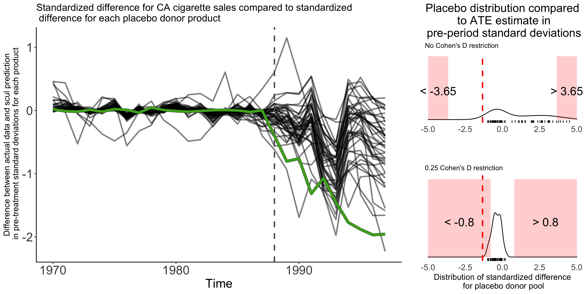
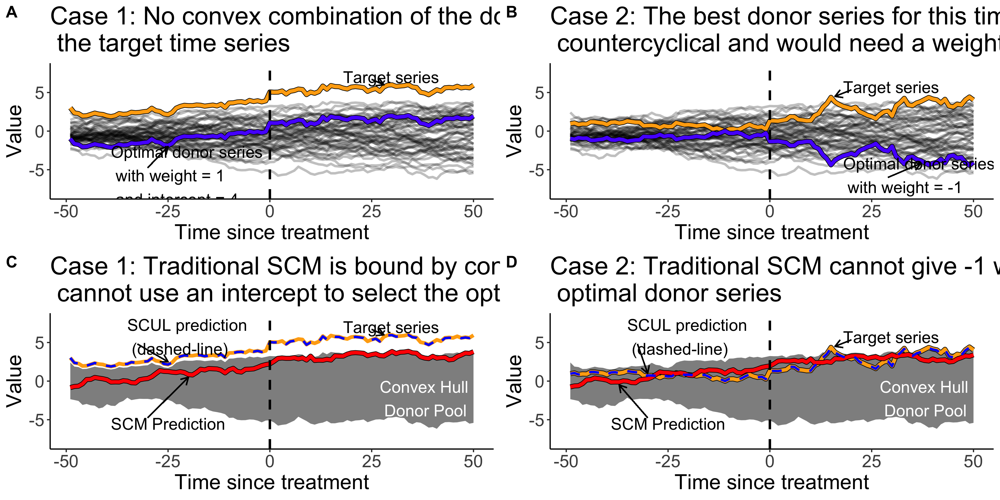

  
  <!-- README.md is generated from README.Rmd. Please edit that file -->
  
  ```{r, include = FALSE}
knitr::opts_chunk$set(
  collapse = TRUE,
  eval = FALSE,
  comment = "#>",
  fig.path = "vignettes/vignette_output",
  out.width = "100%"
)
library(knitr)
```

# Synthetic control using lasso (scul)

This repository contains the R package `scul` that is used in Hollingsworth and Wing (2020) *"Tactics for design and inference in synthetic control studies: An applied example using high-dimensional data."* (link to be posted 3 May 2020)



## Installation

```{r, eval = FALSE}
# Install release version from CRAN
# TBD. Likely available May 2020

# Install development version from GitHub
devtools::install_github("hollina/scul")`
```

## Tutorial
An in-depth tutorial of the package using publicly available data is available here, <https://hollina.github.io/scul/articles/scul-tutorial.html>.

More detail on the procedure can be found in our working paper, (link to be posted 3 May 2020).

## Overview

### What is a synthetic control?

The synthetic control methodology is a strategy for estimating causal treatment effects for idiosyncratic historical events.
In the typical application developed by @Abadie2010, researchers observe time series outcomes for both a treated unit and a number of untreated units.
A weighted average of the untreated series is used to construct a counterfactual estimate of the treated series, which is referred to as a synthetic comparison group.
Weights are chosen to minimize discrepancies between the synthetic comparison group and the treated unit in the pre-treatment time period.
Treatment effect estimates are taken to be the difference between observed outcomes and a synthetic counterfactual.
Statistical inference is normally organized around a placebo analysis; in which, pseudo-treatment effects are estimated for many untreated placebo units, and the distribution of pseudo-estimates represents the null distribution of no treatment effect.

A useful way to think about synthetic controls is as a procedure that attempts to *match* donor series to target series based on the unobserved factors that determine the data generating process.
When framed in this manner identification assumptions and strategies for model selection and inference become more salient.

## Extensions of the traditional method

Recent methodological work has proposed a number of innovative strategies for estimating synthetic control weights [@Arkhangelsky2018; @Doudchenko2017; @Powell2019].
In a similar vein, we use a method called **Synthetic Control Using Lasso (SCUL)** to construct donor weights.

## What is SCUL?

This method is a flexible, data-driven way to construct synthetic control groups.
It relies on lasso regressions, which are popular in the machine-learning literature, and favor weights that predict well out of sample.
In general, our approach allows for: 

  - a high-dimensional donor pool that may be larger than the number of time periods
  - a simple way of ensuring that the same model selection procedure are used for target and placebo series
  - a wide variety of variable types to serve as candidate donors 
  - extrapolation from the donor pool
  - counter-cyclical weights


Our working paper also highlights **identification assumptions** and **recommendations** that are relevant for any synthetic control study. 

## SCUL contributions 

### 1. Clarifying idenficiation assumptions

We outline two simple identification assumptions required for a synthetic control design to identify causal treatment parameters: 

  1. conditional independence of treatment exposure and potential outcomes after matching on an underlying factor structure
  1. no dormant factors during the pre-treatment period. 
  
While neither of these assumptions is directly testable, our working paper offers perspectives and strategies that may help in interpreting the validity of such assumptions in applied work. 

### 2. Providing recommendations for ad hoc choices

Our recommendations for decisions that commonly appear in synthetic control studies include: 

  1. using the same model selection procedure for both target and placebo products
  1. using a unit-free measure to evaluate model fit
  1. discarding both potential target series and placebo series (used in inference) that do poorly on a pre-specified threshold of model fit
  1. incorporating a rolling-origin cross-validation procedure to determine optimal weights
  1. reporting synthetic control weights as the average contribution to the synthetic prediction rather than as a numeric coefficient
  1.  using a unit-free measure of the treatment effect estimate to compare estimated treatment effects to the placebo distribution for inference
  1. reporting the minimum detectable effect size for a given significance level that a given placebo distribution would consider statistically different than zero


We implement versions of the recommendations in our [tutorial](https://hollina.github.io/scul/articles/scul-tutorial.html) and outline each in more detail in our working paper. 

### 3. Using machine-learning that enables a high-dimensional donor pool and automates model selection

Lasso regressions penalize specifications with numerious variables and large coeficients. 
This drives the value of many coefficients to zero and  allows for the inclusion of very large donor pools.
A benefit of this is that---so long as a donor is theoreticlally valid--- a researcher will not need to decide whether to include one donor over another. 
A cost of this is the concern that the procedure could overfit the data. 
SCUL weights are created using cross-validated lasso regressions that ensure the weights do not "overfit" the data and that favor out-of-sample prediction.  

By automating model selection and allowing for a large number of donors, we reduce "researcher degrees of freedom." It is easy to imagine that the best synthetic prediction could be created for each target series, but less time would be spent perfect the model for each placebo series. If the automated model selection results in better fit for placebo series, we also improve the statistical power. This occurs if better fit in the pre-treatment period results in less deterioration (i.e., better fit) in the post-period. This improves statistical power because statistical inference in done by comparing deviations of the treated series to the distribution of placebo deviations. Therefore reducing the spread of the placebo null-distribution allows for smaller deviations of the treated unit to be considered statistically rare.

### 4. Including a wide variety of donor types

We frame synthetic controls as a way of matching on unobserved underlying factors that form the data generating process.
When viewed in this context, using donor units from a wide range of variable types makes sense because different variable types may help pin down different underlying factors/features of the data generating process for the treated unit.
As such **we use a wide range of donor variables** to construct our synthetic control groups, not just the same variable type as the target variable as is common practice.


### 5. Allowing for extrapolation and negative weights

The traditional synthetic control method restricts weights to be non-negative and to sum to one.
These restrictions force the synthetic control group to remain within the support (i.e., convex hull) of the donor pool, preventing extrapolation.
This can certainly be a desirable property.
However there are some situations where these restrictions that prevent extrapolation can inhibit a synthetic control group from finding a perfect donor series.

  - Case 1: When the target series is outside the the support of the donor pool (i.e. you need extrapolation to match the target series
  - Case 2: When negatively correlated donors can help identify underlying data generating process (e.g., two financial assets, or a price and consumption series)
                                                                               



                                                                               
## What else does the working paper do?
                                                                               
This working paper, which is co-authored with Coady Wing, uses the SCUL method to estimate how recreational marijuana legalization affects sales of alcohol and over-the-counter painkillers, finding reductions in alcohol sales. 

The paper uses retail scanner data from Nielsen cannot be publicly posted online, but are available for purchase from the Kilts Center for Marketing at the University of Chicago, https://www.chicagobooth.edu/research/kilts/datasets/nielsen.

## What does this package/vignette do?

This package provides code to implement the SCUL procedure.
Because the data in our working paper cannot be posted online, we also provide an example that uses publicly available data.
The entire procedure or parts of the method may be useful in many settings.
Feel free to use any or all of the code; it is available under the MIT license.

### Software Used:
The package is made for R. and was developed on a Unix machine using R 3.6.1. See session info in the vignette for exact version of every package used. Documentation was made using `roxygen2`, `pkgdown`, and `RStudio`. 

### License:
Replication Package (this github repo): [](https://opensource.org/licenses/MIT)

Working Paper: [](https://creativecommons.org/licenses/by/4.0/)

## To Do:

1. Post working paper
1. Add examples to each function
1. Create function for smoke plot
1. Proof read documentation
1. Submit package via CRAN

## References 
