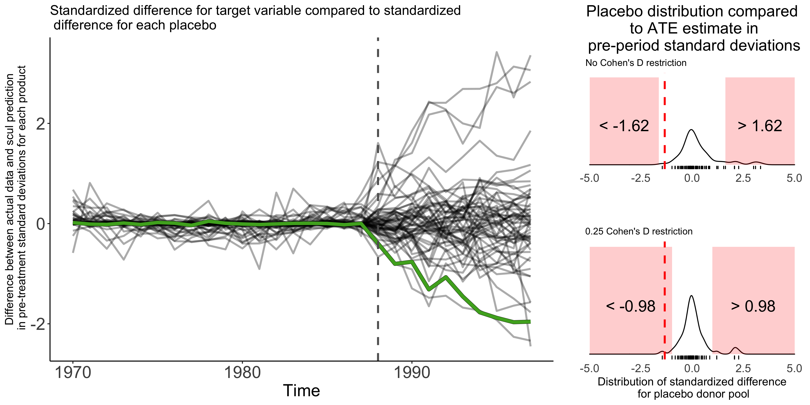
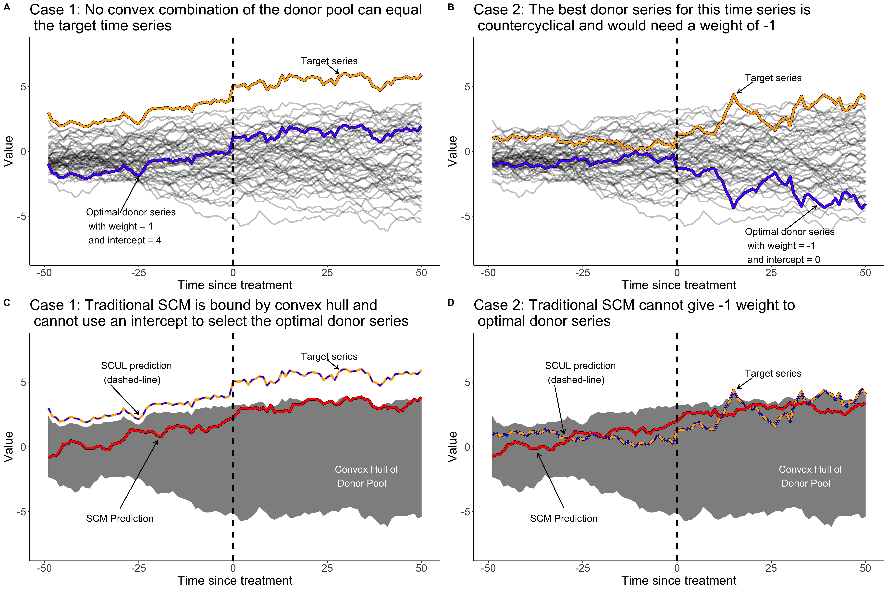

<!-- README.md is generated from README.Rmd. Please edit that file -->

# Synthetic Control Using Lasso (scul) 

<!-- badges: start -->

[](https://travis-ci.com/hollina/scul)
[](https://www.tidyverse.org/lifecycle/#experimental)
[](https://opensource.org/licenses/MIT)
<!-- badges: end -->

This repository contains the R package `scul` that is used in
Hollingsworth and Wing (2020) *“Tactics for design and inference in
synthetic control studies: An applied example using high-dimensional
data.”*
<https://doi.org/10.31235/osf.io/fc9xt>



## Installation

``` r
# Install development version from GitHub (CRAN coming soon) using these two lines of code
if (!require("devtools")) install.packages("devtools")
devtools::install_github("hollina/scul")`
```

## Tutorial/More details

An in-depth tutorial of the package and overview of every function in
the package is available here,
<https://hollina.github.io/scul/articles/scul-tutorial.html>. The
tutorial uses publicly available data and discusses many features of the
SCUL procedure. The tutorial also provides a simple comparison of the
SCUL method to the traditional synthetic control method.

More details on SCUL can be found in our [working
paper](https://doi.org/10.31235/osf.io/fc9xt). The paper, joint with
Coady Wing, desribes identification assumptions and recommendations for
key—and normally ad hoc—decisions that arise in most synthetic control
studies. The paper then describes the SCUL method and uses the procedure
to estimate how recreational marijuana legalization affects sales of
alcohol and over-the-counter painkillers, finding reductions in alcohol
sales.

## What is a synthetic control?

The synthetic control methodology is a strategy for estimating causal
treatment effects for idiosyncratic historical events. In the typical
application developed by Abadie, Diamond, and Hainmueller (2010),
researchers observe time series outcomes for both a treated unit and a
number of untreated units. A weighted average of the untreated series is
used as a counterfactual estimate of the treated series, which is
referred to as a synthetic comparison group. Weights are chosen to
minimize discrepancies between the synthetic comparison group and the
treated unit in the pre-treatment time period. Treatment effect
estimates are usually the difference between observed outcomes and the
synthetic counterfactual. Statistical inference is normally organized
around a placebo analysis; in which, pseudo-treatment effects are
estimated for many untreated placebo units, and the distribution of
pseudo-estimates represents the null distribution of no treatment
effect.

A useful way to think about synthetic controls is as a procedure that
attempts to *match* donor series to target series based on the
unobserved factors that determine the data generating process. When
framed in this manner identification assumptions and strategies for
model selection/inference become more salient.

Recent methodological work has proposed a number of innovative
strategies for estimating synthetic control weights (Arkhangelsky et al.
2018; Doudchenko and Imbens 2017; Powell 2019). In a similar vein, we
construct donor weights using a method we call **Synthetic Control Using
Lasso (SCUL)**.

## What is SCUL?

This method is a flexible, data-driven way to construct synthetic
control groups. It relies on lasso regressions, which are popular in the
machine-learning literature, and favor weights that predict well out of
sample.

Our working paper highlights **identification assumptions** and
**recommendations** that are relevant for any synthetic control study.

In general, our approach allows for:

  - a high-dimensional donor pool that may be larger than the number of
    time periods
  - a simple way of ensuring that the same model selection procedure are
    used for target and placebo series
  - a wide variety of variable types to serve as candidate donors
  - extrapolation from the donor pool
  - counter-cyclical weights

We consider the combination of this statistical approach and following
these recommendations as the SCUL
procedure

## What are the contributions of SCUL?

### 1\. Clarifies idenficiation assumptions for synthetic control methods

We outline two simple identification assumptions required for a
synthetic control design to identify causal treatment parameters:

1.  conditional independence of treatment exposure and potential
    outcomes after matching on an underlying factor structure
2.  no dormant factors during the pre-treatment period.

While neither of these assumptions is directly testable, our working
paper offers perspectives and strategies that may help in interpreting
the validity of such assumptions in applied work.

### 2\. Provides recommendations for normally ad hoc choices

Our recommendations for decisions that commonly appear in synthetic
control studies include:

1.  using the same model selection procedure for both target and placebo
    products
2.  using a unit-free measure to evaluate model fit
3.  discarding both potential target series and placebo series (used in
    inference) that do poorly on a pre-specified threshold of model fit
4.  incorporating a rolling-origin cross-validation procedure to
    determine optimal weights
5.  reporting synthetic control weights as the average contribution to
    the synthetic prediction rather than as a numeric coefficient
6.  using a unit-free measure of the treatment effect estimate to
    compare estimated treatment effects to the placebo distribution for
    inference
7.  reporting the minimum treatment effect size for a given significance
    level that the placebo distribution used for inference would
    consider statistically different than zero

We implement versions of the recommendations in our
[tutorial](https://hollina.github.io/scul/articles/scul-tutorial.html)
and outline each in more detail in our working
paper.

### 3\. Uses machine-learning approach that allows for high-dimensional donor pool and automates model selection

Lasso regressions penalize specifications with numerious variables and
large coeficients. This drives the value of many coefficients to zero
and allows for the inclusion of very large donor pools. A benefit of
this is that—so long as a donor is theoreticlally valid— a researcher
will not need to decide whether to include one donor over another. A
cost of this is the concern that the procedure could overfit the data.
SCUL weights are created using cross-validated lasso regressions that
ensure the weights do not “overfit” the data and that favor
out-of-sample prediction.

By automating model selection and allowing for a large number of donors,
we reduce “researcher degrees of freedom.” It is easy to imagine that
the best synthetic prediction could be created for each target series,
but less time would be spent perfecting the model for each placebo
series. If the automated model selection results in better fit for
placebo series, we also improve the statistical power. This occurs if
better fit in the pre-treatment period results in less deterioration
(i.e., better fit) in the post-period. This improves statistical power
because statistical inference in done by comparing deviations of the
treated series to the distribution of placebo deviations. Therefore
reducing the spread of the placebo null-distribution allows for smaller
deviations of the treated unit to be considered statistically rare.

### 4\. Includes a wide variety of donor types

We frame synthetic controls as a way of matching on unobserved
underlying factors that form the data generating process. When viewed in
this context, using donor units from a wide range of variable types
makes sense because different variable types may help pin down different
underlying factors/features of the data generating process for the
treated unit. As such **we use a wide range of donor variables** to
construct our synthetic control groups, not just the same variable type
as the target variable as is common practice.

### 5\. Allows for extrapolation and negative weights

The traditional synthetic control method restricts weights to be
non-negative and to sum to one. These restrictions force the synthetic
control group to remain within the support (i.e., convex hull) of the
donor pool, preventing extrapolation. This can certainly be a desirable
property. However there are some situations where these restrictions
that prevent extrapolation can inhibit a synthetic control group from
finding a perfect donor series.

  - Case 1: When the target series is outside the the support of the
    donor pool (i.e. you need extrapolation to match the target series
  - Case 2: When negatively correlated donors can help identify
    underlying data generating process (e.g., two financial assets, or a
    price and consumption series)



## Software Used:

The package is made for R. and was developed on a Unix machine using R
3.6.1. See session info in the vignette for exact version of every
package used. Documentation was made using `roxygen2`, `pkgdown`, and
`RStudio`.

## To Do:

1.  Add examples to each function
2.  Proof read documentation
3.  Release package via CRAN
4.  Distribute video FAQs

## References

<div id="refs" class="references">

<div id="ref-Abadie2010">

Abadie, Alberto, Alexis Diamond, and Jens Hainmueller. 2010. “Synthetic
Control Methods for Comparative Case Studies: Estimating the Effect of
California’s Tobacco Control Program.” *Journal of the American
Statistical Association* 105 (490): 493–505.
<https://doi.org/10.1198/jasa.2009.ap08746>.

</div>

<div id="ref-Arkhangelsky2018">

Arkhangelsky, Dmitry, Susan Athey, David A. Hirshberg, Guido W. Imbens,
and Stefan Wager. 2018. “Synthetic Difference in Differences.”
<http://arxiv.org/abs/1812.09970>.

</div>

<div id="ref-Doudchenko2017">

Doudchenko, Nikolay, and Guido W. Imbens. 2017. “Balancing, Regression,
Difference-In-Differences and Synthetic Control Methods: A Synthesis.”
<http://arxiv.org/abs/1610.07748>.

</div>

<div id="ref-Powell2019">

Powell, David. 2019. “Imperfect Synthetic Controls,” no. May 2017: 1–38.
<https://sites.google.com/site/davidmatthewpowell/imperfect-synthetic-controls>.

</div>

</div>
